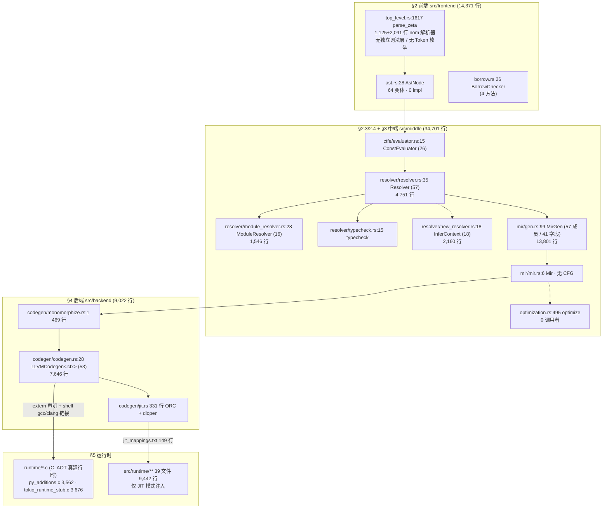
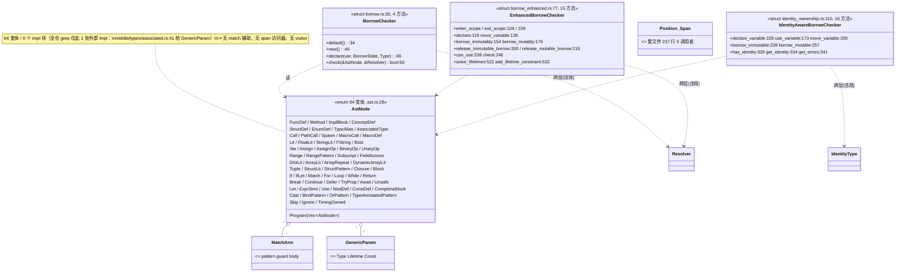
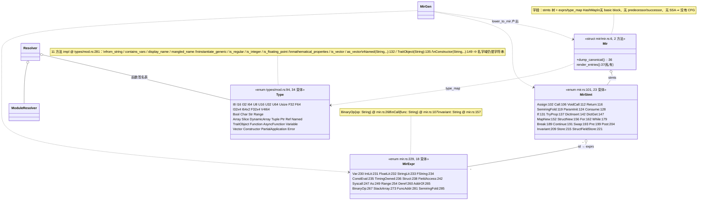

# Zeta 模块 / 架构 / 类设计分析（对照 pyramid.md 分层模型）

生成日期：2026-09-23。结构口径来自 `codegraph`（`.codegraph/codegraph.db`），文本口径来自 `grep`/`find`，
两者不一致处逐条标注。每条结构边给出 `file:line`，可抽查。

---

## 0. 口径与读数

### 0.1 索引健康度（查询前置）

```
$ codegraph status
Files: 378   Nodes: 7,246   Edges: 30,035   Backend: node:sqlite (full WAL)
Nodes by kind: function 2845 / method 1627 / import 914 / enum_member 737 /
               file 372 / struct 362 / variable 217 / enum 111 / type_alias 29 /
               trait 18 / class 12 / constant 2
Files by language: rust 330 / python 32
```

节点数 > 仓内 `.rs` 文件数（330 vs 172），因为索引把 `tests/`、`tools/`、`pylib` 侧的 python 一并计入。
下文「类/枚举/函数普查」用 `grep` 只量 `src/`，两套口径不互换。

### 0.2 仓库普查（只量 `src/`，本次实测）

```
$ find src -name '*.rs' | wc -l                     → 172 文件
$ find src -name '*.rs' -exec cat {} + | wc -l      → 90,571 行
$ grep -rhoE '^pub struct |^struct '  src --include='*.rs' | wc -l  → 333
$ grep -rhoE '^pub enum  |^enum '     src --include='*.rs' | wc -l  → 109
$ grep -rhoE '^pub trait |^trait '    src --include='*.rs' | wc -l  →  27
$ grep -rcE  '^impl' src --include='*.rs' | 累合      → 343
$ grep -rhoE '^\s*(pub )?fn ' src --include='*.rs' | wc -l          → 2,241
```

> 333 是「行首声明」的 struct；codegraph 报 362 个 struct 节点（含缩进/`pub(crate)` 声明）。
> 引用时以 333 为准并说明作用域，不混用。

### 0.3 分层规模（`find src/<dir> -name '*.rs'`，本次实测）

| 目录 | 文件 | 行 | 占 `src/` 行比 | pyramid 归属 |
|---|---:|---:|---:|---|
| `src/frontend` | 19 | 14,371 | 15.9% | §2 前端 |
| `src/middle` | 34 | 34,701 | 38.3% | §3 中端（含 §2.3/2.4 的解析与类型检查） |
| `src/backend` | 8 | 9,022 | 10.0% | §4 后端 |
| `src/runtime` | 39 | 9,442 | 10.4% | §5 运行时（第二运行时，见 §5.4） |
| `src/std` | 11 | 3,281 | 3.6% | §5.4 标准库（Rust 侧，编译器实际不走这里） |
| `src/tests` | 9 | 396 | 0.4% | §6 正确性（未编译，见 §6） |
| 陪跑 7 簇（下 §6.2） | 49 | 15,587 | 17.2% | 无归属 |
| 其余（`main.rs`/`lib.rs`/`diagnostics.rs`/`error_codes.rs`/`pylib.rs`…） | 34 | ~13,000 | ~14% | §7 工程 |

---

## 1. 模块关系图

### 1.1 主干（编译管线，按 `src/main.rs` 实测顺序接线）



实线 = 图内有调用边（下表 §3 逐条给行号）；虚线 = 符号存在但生产路径无调用者。

### 1.2 管线接线（`src/main.rs`，图证据）

| 阶段 | 调用点 | 被调符号定义 |
|---|---|---|
| 读入 + 解析 | `main.rs:711` / `:714` | `parser/top_level.rs:1617` |
| 截断检查 | `main.rs:717`（fn 在 `:391`） | `ensure_fully_parsed` |
| CTFE | `main.rs:719` | `ctfe/evaluator.rs:15` |
| 宏展开 | `main.rs:755` | `resolver.rs:3407 expand_macros` |
| 注册 | `main.rs:764` | `resolver.rs:183 register` |
| 无标注返回推断 | `main.rs:768` | `resolver.rs:1200 infer_untyped_returns` |
| 类型检查 | `main.rs:781` | `typecheck.rs:15 typecheck` |
| 降 MIR | `main.rs:797`（闭包合并 `:806`） | `resolver.rs:3046 lower_to_mir` → `gen.rs:863` |
| 单态化 | `main.rs:845-847` | `monomorphize.rs` ← `codegen.rs:2564-2595` |
| Codegen | `main.rs:897 gen_mirs` | `codegen.rs:1407` |
| AOT 链接 | `main.rs:920` / `:965`（`:982-1002`, `:1211`） | shell `gcc`/`clang` + `runtime/*.o` |
| JIT | `main.rs:1018` / `:1022` | `codegen/jit.rs` |
| bootstrap | `main.rs:1118 bootstrap_zeta` | 同上全链 |

**关键断链**：`main.rs` 的 15 个阶段里没有任何一步调用 `middle/optimization.rs:495 optimize`。
`codegraph callers optimize` → `No callers found`（符号存在，见 `optimization.rs:495`；grep 复核：
`optimize(` 在 `src/main.rs`、`src/lib.rs` 均无出现）。pyramid §3.3 的判据「两周无收益即删」直接命中此文件（603 行）。

### 1.3 跨层违规（pyramid §0 公理：只许向下依赖）

`grep -rn "use crate::middle" src/frontend/` 与 `grep -rn "crate::middle::" src/frontend/`：

| # | 违规点 | 方向 | 性质 |
|---|---|---|---|
| 1 | `parser/top_level.rs:1188`、`:1191` → `middle::pylib::find_member` | 前端 → 中端 | 解析器直接查符号表，最硬的一处 |
| 2 | `macro_expand.rs:655` → `middle::types::handle_derive_attribute` | 前端 → 中端 | 宏展开产类型 |
| 3 | `borrow.rs:7` ↔ `resolver.rs:9` | 前端 ↔ 中端 | **双向环**（两个 crate:: 互相 use） |
| 4 | `borrow_enhanced.rs:11` → `middle::resolver::resolver::{Resolver, Type}` | 前端 → 中端 | 同类（未接线） |
| 5 | `borrow_enhanced.rs:12`、`identity_ownership.rs:9` → `middle::types::lifetime` | 前端 → 中端 | 生命周期类型住在中端 |
| 6 | `identity_ownership.rs:7-8`、`parser/identity_type.rs:17` → `middle::types::identity` | 前端 → 中端 | identity 类型住在中端 |
| 7 | `parser/location.rs` → `crate::diagnostics` | 前端 → 诊断 | 可接受（横切） |

反向检查：`grep -rn "use crate::backend" src/frontend src/middle` → **0 命中**，后端不泄漏进前端/中端。
`src/runtime` → `crate::middle` 有 7 处（`runtime/identity/bridge.rs`、`mod.rs`），运行时依赖中端类型定义，
属 §5→§3 的向上依赖，是第二运行时（§5.4）的结构性副作用。

---

## 2. 类图

### 2.1 前端



`codegraph callers` 裁决三者的接线状态：

- `BorrowChecker` → callers 含 `middle/resolver/resolver.rs:1`，**活**（`resolver.rs:39` 构造）。
- `EnhancedBorrowChecker` → `No callers found`（图内无边）。grep 复核：唯一使用点在
  `tests/memory-management/integration_test.rs:4`，且该 test 是否在 `Cargo.toml [[test]]` 注册未查证 ⇒ 生产未接线。
- `IdentityAwareBorrowChecker` → `No callers found`；`identity_ownership/tests.rs`(169 行) 是**孤儿文件**，
  其宿主 `identity_ownership.rs:392` 有 inline `mod tests`，两者不同一份，前者不参与编译。

### 2.2 中端：类型系统 + MIR



### 2.3 中端：三套并行的类型推断/检查

```mermaid
classDiagram
    class Resolver {
        <<struct resolver/resolver.rs:35, 57 成员 · 4,751 行>>
        +register(AstNode):183
        +expand_macros(&[AstNode]):3407
        +infer_untyped_returns:1200
        +lower_to_mir(&AstNode) Mir:3046
        +monomorphize(MonoKey, &AstNode):3344
        +infer(...):2783
        +resolve_impl:1156  get_func_signature:1164
        +find_py_module_file_ranked:2238
        +load_user_python_module:2304
    }
    class Typecheck_trackA { typecheck.rs:15 typecheck · :353 infer_type 生产在用 }
    class InferContext {
        <<struct new_resolver/new_resolver.rs:18, 18 方法 · 2,160 行>>
        +infer(&AstNode) Result~Type~:589
        +solve():1714  constrain():84  constrain_eq():90
        +enter_generic_scope:1735 / exit:1744
        +infer_generic_call:1751
    }
    class UnifiedTypeChecker { <<struct unified_typecheck.rs:52, 7 方法>> +typecheck_unified:83 }
    class TypeCheckMigrator { typecheck_new.rs:400，整段 #[cfg(test)] }
    Resolver ..> Typecheck_trackA : main.rs:781
    InferContext ..> Type : 仅自身 new/clone 被调
    UnifiedTypeChecker ..> Resolver
```

`codegraph callers` 三句判决：

```
callers InferContext      → 2 条，全在 new_resolver.rs 内部(:48 new, :1906 clone)   ⇒ 生产未接线
callers UnifiedTypeChecker→ No callers found
callers TypeCheckMigrator → 1 条：typecheck_new.rs:406（自己文件内的 new，#[cfg(test)]）
```

⇒ 回答 pyramid 问3：类型检查名义上是一个 pass（`main.rs:781` 在 `lower_to_mir :797` 之前），
实际同一表达式有**三个回答者**：`new_resolver.rs:589` 合一算法、`typecheck.rs:353` 兜底 `infer_type`、
`MirGen` 的局部推断（`gen.rs:13131 get_common_element_type`）。后两者在管线上，前两者不在。

### 2.4 后端

```mermaid
classDiagram
    class LLVMCodegen {
        <<struct codegen/codegen.rs:28, 53 成员 · 7,646 行>>
        +new(&Context, name):81
        +gen_mirs(&[Mir]):1407
        +gen_fn(&Mir):1535
        +gen_stmt:3335  gen_expr:5736  gen_expr_safe:5685
        +mangle_function_name:1363  (:7631 第二处 mangling)
        +get_or_declare_function:2636 (310 行启发式瀑布)
        +get_function_with_types:2524
        +monomorphize_function:3011
        +handle_simd_operation:7084  simd_binop:7381
        +collect_slot_reads:1633  collect_all_local_ids:1719
        +infer_fn_return_type(&Mir):1392
        +report_abi_coercions:1342
    }
    class JitEngine { jit.rs 331 行：ORC + dlopen 回退 :59-63 }
    class Monomorphize { monomorphize.rs 469 行 ← codegen.rs:2564-2595 }
    class RuntimeDecls { runtime_decls_core.rs 80 / runtime_decls_registry.rs 312（由 txt 生成）}
    LLVMCodegen ..> Mir : 唯一输入
    LLVMCodegen ..> Type : mangle/instantiate
    LLVMCodegen --> Monomorphize : :2564
    LLVMCodegen --> RuntimeDecls : :985 extern 声明 (inkwell add_function :2594)
    JitEngine --> LLVMCodegen : finalize_and_aot jit.rs:256
```

---

## 3. 类依赖矩阵（`codegraph callers`，活/未接线标注）

行 = 被依赖者，列 = 语义。所有边均可用 `codegraph callers <行名>` 复现。

| 类 / 函数 | 定义 | 图内调用者 | 裁决 |
|---|---|---|---|
| `MirGen` | `mir/gen.rs:99` | 1：`gen.rs:4407 process_block`（自递归） | 活；入口 `lower_to_mir:863` 由 `resolver.rs:3046` 调 |
| `LLVMCodegen` | `backend/codegen/codegen.rs:28` | 2：`codegen/mod.rs:1`、`jit.rs:256 finalize_and_aot` | 活；`main.rs:897` |
| `Resolver` | `resolver/resolver.rs:35` | 11（含 `borrow.rs:1`、`borrow_enhanced.rs:1`、`typecheck.rs:1`、`typecheck_new.rs:1`、`unified_typecheck.rs:1`、`lib.rs:1`，方法级 `borrow.rs:56 check`） | 活；**全仓最大枢纽**，6 个上游 |
| `ModuleResolver` | `resolver/module_resolver.rs:28` | 1：`resolver.rs:1` | 活；单一持有者 |
| `ConstEvaluator` | `ctfe/evaluator.rs:15` | 2：`const_eval.rs:1`、`ctfe/mod.rs:1` | 活；`main.rs:719` |
| `InferContext` | `resolver/new_resolver.rs:18` | 2（均在自身文件） | **未接线** |
| `BorrowChecker` | `frontend/borrow.rs:26` | 见 `resolver.rs:1` import、`:39` 字段 `RefCell<BorrowChecker>` | 活 |
| `EnhancedBorrowChecker` | `frontend/borrow_enhanced.rs:77` | 0 | **未接线**（仅 test 引用） |
| `IdentityAwareBorrowChecker` | `frontend/identity_ownership.rs:110` | 0 | **未接线** |
| `AdvancedMacroExpander` | `frontend/macro_expand_advanced.rs:79` | 0 | **未接线**（617 行） |
| `ProcMacroRegistry` | `frontend/proc_macro.rs:141` | 2（均在 `macro_expand_advanced.rs`，其自身未接线） | **未接线（二级）**：845 + 617 行整族陪跑 |
| `UnifiedTypeChecker` | `resolver/unified_typecheck.rs:52` | 0 | **未接线** |
| `TypeCheckMigrator` | `resolver/typecheck_new.rs:400` | 1（`#[cfg(test)]` 内） | **测试专用** |
| `optimization::optimize` | `middle/optimization.rs:495` | 0 | **未接线**（603 行） |
| `parse_zeta` | `parser/top_level.rs:1617` | 20（含 `src/bin/pipeline_dump.rs`、`src/tests/*` 非编译、`module_resolver.rs:615`） | 活 |
| `lower_to_mir` | `resolver.rs:3046` → `gen.rs:863` | 7：`main.rs:533`、`main.rs:1118`、`repl`、`pipeline_dump.rs`、`resolver.rs:3046` | 活 |
| `expand_macros` | `resolver.rs:3407` | 4：`main.rs:533`、`:1118`、`lib.rs:91`、`lib.rs:822` | 活 |
| `gen_mirs` | `codegen.rs:1407` | 5：`main.rs:533/:1118/:1245`、`lib.rs:91/:822` | 活 |
| `compile_with_diagnostics` | `lib.rs:822` | 5，全部在 `tests/integration/integration_error_handling.rs` | **仅测试**（诊断黑 hole 的一环，见 §5.5） |
| `Mir::dump_canonical` | `mir.rs:36` | `--dump-mir` 接线在 `main.rs:543/578/878-881/1295-1301` | 活 |
| `Mir` 校验器 | — | grep `MirVerifier\|verify_mir` → 0 命中 | **不存在**（pyramid §3.1 要求） |

跨语言边提示（codegraph 已知盲区，绝对结论已 grep 复核）：`codegen.rs` 对 C 运行时的调用是 inkwell
`add_function` 生成的 extern，**图内无边**；全仓 Rust 侧真实 `extern "C"` 只有 `jit.rs:245` 一处。

---

## 4. 类功能函数列表

方法行号取自 `codegraph node <类> --symbols-only`（`成员名 (method):<行>`）。

### 4.1 `Resolver` — `src/middle/resolver/resolver.rs:35`，57 成员，文件 4,751 行

按职责聚簇（这是全仓最需要拆的枢纽，六个 caller 入口都落在它身上）：

| 簇 | 方法（行号） |
|---|---|
| 生命周期/缓存 | `new:120`, `load_specialization_cache:160`, `persist_specialization_cache:174`, `set_source_dir:2142`, `default:4455`, `drop:4461` |
| 注册与遍历 | `register:183`, `walk_nonlocal:200`, `walk_module:261`, `walk_py_import:289`, `walk_argparse:653`, `get_registered_funcs:3521`, `register_builtin_functions:3527` |
| 签名/分派 | `resolve_impl:1156`, `get_func_signature:1164`, `get_all_func_signatures:1171`, `report_untyped_params:1176`, `func_param_names:2113`, `module_renames_for:2614` |
| 推断 | `infer_untyped_returns:1200`, `collect_returns:1204`, `collect_map_locals:1225`, `classify:1253`, `collect_calls:1474`, `module_global_types:1659`, `infer_global_ty:1663`, `method_result_ty:1907`, `walk:1982`, `unannotated_return_ty:2730`, `is_unit:2736`, `class_ty:2743`, `infer:2783`, `walk:2840`, `dict_comprehension_ret:2958`, `pair_from:2959`, `shim_class_normalize:3022`, `is_nonlocal_name:3206`, `ast_to_const_value:3219`, `returns_json_loads:2693`, `is_json_loads:2694`, `import_alias:2758`, `both…`（其余见文件） |
| PY-A 模块 | `resolve_py_module_spec:2169`, `find_py_module_file:2227`, `find_py_module_file_ranked:2238`, `load_user_python_module:2304`, `resolve_reexport_target:2580`, `py_module_init_symbol:2601` |
| 降 MIR / 单态化 | `lower_to_mir:3046`, `take_generated_closures:3211`, `is_abi_stable:2125`, `record_mono:2129`, `collect_used_specializations:3257`, `walk:3262`, `monomorphize:3344`, `substitute:3355` |
| 宏 | `expand_macros:3407`, `expand_macros_in_node:3419` |

### 4.2 `MirGen` — `src/middle/mir/gen.rs:99`，57 成员，文件 13,801 行（HEAD 为 13,796；工作树有并行会话在 `:13757`
起的 5 行未提交新增，落在本文引用的所有方法行号之后，不影响它们），**41 字段**

| 簇（行段） | 方法 |
|---|---|
| 构造 + builder 注入 `234-840`（12 个只读注入字段） | `new:234`, `with_global_consts:284`, `with_module_global_types:293`, `with_func_param_names:299`, `with_func_ret_types:304`, `with_nonlocal_names:320`, `with_module_globals:329`, `with_py_imports:335`, `with_py_user_modules:346`, `with_symbol_renames:352`, `with_type_decls:807`, `with_current_module:813`, `with_source_file:818`, `with_argparse_kinds:824`, `with_param_defaults:830` |
| env/槽位原语 `78-360` | `i64_zero_id:312`, `flatten_module_receiver:361`, `global_ty_of:385`, `receiver_global_key:419` |
| PY 成员/handle `436-806` | `py_member_target:436`, `py_member_call:471`, `py_struct_type_of:595`, `py_struct_has_field:614`, `qualified_method_candidate:634`, `py_handle_of:672`, `thread_args_tuple:740`, `warn_unbound:789` |
| 函数编排 `863-1194` | `force_entry_returns:841`, `lower_to_mir:863`, `lower_ast:1195` |
| 语句降型 `1195-2898` | `lower_ast_inner:1206`（≈1,700 行）, `process_block:4407` |
| 表达式助手 `2899-3168` | `materialize_for_call:2899`, `lower_map_key_typed:2911`, `lower_map_key:2931`, `annotation_elem_ty:2952`, `annotation_named_ty:2977`, `both_branches_are_strings:2996`, `lower_to_string:3021`, `enum_unit_variant_index:3052`, `lower_range_guard:3071`, `emit_norm_index:3117`, `normalize_subscript_index:3135` |
| 派发 | `lower_expr:3169` |
| 其余大段（单文件行段实测） | BinaryOp `3519-4306`(≈790) · 控制流 `4307-4648` · **Call/成员派发 `4649-10665`(≈6,017)** · Match `10666-11130` · 字段/结构/路径 `11131-11905` · 数组/下标/转型 `11906-12603` · 一元+状态助手 `12604-13155`（`next_id:13084`）· 闭包 `13157-13607`（`collect_free_vars:13157`, `lower_closure:13333`, `build_mir:13585`）· 尾部 `13622-13796` |

阻塞拆分的共享可变状态（拆文件前必须先解决的清单）：输出 arena `gen.rs:100-105`、旁路字段
`array_lit_lens:113`、`pointee_widths:116`、`tuple_slots:212`、`py_json_items_ids:141`、闭包协议
`pending_closure_param_types:134`、`last_closure_ret_ty:144`、`last_dict_pair_ty:151`。
已有子 `MirGen` 先例：`gen.rs:13416`。

### 4.3 `LLVMCodegen<'ctx>` — `src/backend/codegen/codegen.rs:28`，53 成员，文件 7,646 行

`new:81` · `report_abi_coercions:1342` · `mangle_function_name:1363` · `void_decl_shadow:1388` ·
`infer_fn_return_type:1392` · `gen_mirs:1407` · `gen_fn:1535` · `collect_slot_reads:1633` ·
`slot_or_sitofp:1702` · `collect_all_local_ids:1719` · `collect_ids_from_stmt_safe:1733` ·
`collect_ids_from_expr_safe:1927` · `build_floordiv_int:2016` · `build_floormod_int:2049` ·
`build_floordiv_float:2081` · `is_operator:2096` · `is_simd_operation:2158` ·
`parse_simd_type_info:2167` · `simd_vector_type:2185` · `get_function_with_types:2524` ·
`get_or_declare_function:2636` · `monomorphize_function:3011` · `substitute_stmt:3098` ·
`gen_stmt:3335` · `resolve_struct_field_index:5698` · `gen_expr_safe:5685` · `gen_expr:5736` ·
`handle_simd_operation:7084` · `simd_binop:7381` · 第二处 mangling `:7631`

### 4.4 `ModuleResolver` — `src/middle/resolver/module_resolver.rs:28`，16 成员

`new:38` · `set_root_dir:48` · `resolve_use_path:54` · `load_module:615` · `load_std_module:699` ·
`load_virtual_module:797` · `process_use_statement:1039` · `lookup:1126` · `get_modules:1131` ·
`get_imports:1136` · `create_std_stub:1141` · `generate_std_stub_content:1167` ·
`create_external_stub:1359` · `generate_external_stub_content:1389` ·
`create_zorb_package_stub:1443` · `generate_zorb_package_stub_content:1469`

> 后 6 个方法从内嵌的假 std 源码自动生 stub（`module_resolver.rs:1166` 起）。这正是 backlog #86
> 「W1007 为何一声不出」的 ② 号分支落点：`process_use_statement:1039` 的 `Err` 几乎不可能被触发。

### 4.5 `ConstEvaluator` — `src/middle/ctfe/evaluator.rs:15`，26 成员

`contains_variable:27` · `new:43` · `evaluate_program:52` · `transform_ast_node:78` · `transform_expr:244` ·
`eval_const_expr:580` · `eval_binary_op:728` · `eval_unary_op:747` · `eval_variable:758` ·
`eval_function_call:773` · `eval_builtin_min:796` / `max:819` / `abs:842` ·
`eval_user_function_call:862` · `eval_array_literal:974` · `eval_if_expr_with_else:993` ·
`body_has_let_decls:1038` · `eval_block:1043` · `eval_let_binding:1064` · `eval_assignment:1091` ·
`eval_while_loop:1138` · `eval_loop:1188` · `eval_for_loop:1198` · `try_eval_const_call:1278` ·
`visit:1313` · `transform:1320`（`visit`/`transform` 来自 `AstVisitor` trait——全仓 27 个 trait 之一）

### 4.6 `InferContext` — `src/middle/resolver/new_resolver.rs:18`，18 成员（未接线）

`default:42` · `new:48` · `lookup:66` · `declare:74` · `add_function:79` · `constrain:84` ·
`constrain_eq:90` · `parse_type_string:96` · `check_pattern:475` · `infer:589` ·
`take_substitution:1709` · `solve:1714` · `enter_generic_scope:1735` · `exit_generic_scope:1744` ·
`infer_generic_call:1751` · `parse_generic_params:1795` · `register_builtin_generics:1876` · `clone:1906`

### 4.7 `Type` — `src/middle/types/mod.rs:94`，34 变体 + 11 方法（impl 在 `:281`）

`from_string` · `contains_vars` · `display_name` · `mangled_name` · `instantiate_generic` ·
`is_regular` · `is_integer` · `is_floating_point` · `mathematical_properties` · `is_vector` · `as_vector`

配套：`TypeVar impl :42`、`TypeParam impl :209`。`types/identity/`（5 文件 / 1,643 行，`find src/middle/types/identity -name '*.rs' -exec cat {} + | wc -l`，在活路径上）；
`types/family.rs`、`types/associated.rs` 仅测试引用。

---

## 5. 架构级发现（对照 pyramid.md）

### 5.1 最大的一颗雷：`MirGen` 与 `Resolver` 各吞 1/6 的仓体量

`gen.rs` 13,801 + `resolver.rs` 4,751 = 18,552 行 = `src/` 的 **20.5%**，落在两个 struct 上。
`Resolver` 有 6 个上游（`codegraph callers` = 11 条边），`MirGen` 有 41 字段。
pyramid §7.1「一个 pass 一个可测试单元」在这两处不成立；拆分前置条件已列在 §4.2。

### 5.2 IR 仍是「树」而不是 IR（pyramid §3.1）

`Mir mir.rs:6` 只有 `dump_canonical` 一个公开方法；无基本块、无使用链、无支配树。
`MirExpr::BinaryOp{op: String}`（`mir.rs:268`）、`MirStmt::Call{func: String}`（`:107`）、
`variant: String`（`:157`）——pyramid W1 债原样存在。全仓无 MIR 校验器。

### 5.3 分派靠字符串字典，三处同构（pyramid §5.3 反模式）

1. `runtime_aliases.txt` → 别名内嵌进 C（`runtime/aliases.inc.c:4`，`#include` 在
   `tokio_runtime_stub.c:358`），**Rust 侧 0 个读者**。
2. `get_or_declare_function` 310 行启发式瀑布，`codegen.rs:2636`。
3. `pylib/jit_mappings.txt`（149 行）裸符号字典：`free → crate::runtime::std::std_free`。

### 5.4 两套并行运行时（pyramid §5.1/§5.2）

- **C 侧**（`runtime/*.c`：`py_additions.c` 3,562 + `tokio_runtime_stub.c` 3,676 + `parquet_min` 780 +
  `capybara` 170 + `unavailable_stubs` 232 + `aliases.inc` 70）= AOT 真运行时，shell `gcc`/`clang` 链接
  （`main.rs:982-1002`、`:1211`）。
- **Rust 侧**（`src/runtime/**` 39 文件 / 9,442 行；`std.rs` 749、`host.rs` 942、`reactor.rs` 626）
  = **只在 JIT 模式注入**，`memory_*`/`xai`/`async_advanced` 无人引用。

值模型（pyramid 问2）：**普通值无 tag**，槽位一律裸 i64，形状靠几何启发式猜
（ABI §1#6/#7、`zt_dyn_vec_hdr` `py_additions.c:3469`、`zt_dyn_is_map` `:3457`）。
唯一带 tag 的是 `PyJson` 16 字节 `[tag,payload]`（`ZJ_NULL..ZJ_BOOL`
`tokio_runtime_stub.c:2550-2556`，`zj_make:2560`）；带 tag 的 `PyDynamic` 仍是「预留」。

### 5.5 诊断有写无读（backlog #86/#87 的根因）

`emit()` 写 thread_local `TL_REPORTER`（`diagnostics.rs:500`），**1 个写点 `:507`，0 个读点**；
`format_all()/take_diagnostics()` 只在 `compile_with_diagnostics`（`lib.rs:822`）里对*局部* reporter 调用，
而该函数的 5 个 caller 全在 `tests/integration/integration_error_handling.rs`。
⇒ 37 个发射点（19 宏 + 18 直接 `emit()`，含 typecheck.rs 的 16 处）流入结构性黑洞。
这把批次 356/357/359 反复取不到读数从「上游拦截」改判为「读取端不存在」。

### 5.6 ABI 治理未运行（pyramid §4.3.a~e）

`docs/ABI.md` §3 / §1+§2 / §5 / §4 / §6 能一一映射到 4.3.a~4.3.e，但门禁不跑：
`grep -c check_abi_anchors tools/run_all.sh` = 0，`.github` 无 workflow 调用它，
`ABI.md:29-30` 自陈「同批改锚点靠人不靠门禁」。`tools/baselines/abi_anchors.tsv` 327 行
= 243 锚点 + 84 待归属。

### 5.7 测试有断言的那一半不在 official 基线里（pyramid §6.2）

772 个 `.z` 用例分 28 目录（python_style 300 全带 `// expect`、unit-tests 194、primezeta 59、
array-parsing 35）。**194 个 official 用例里 `// expect` 命中 0 ⇒ 100% 只编译不断言**。
真实输出断言 ≈ 430（300 + 130 `.dcase`）。

---

## 6. 未接线 / 陪跑模块清单（headline）

`codegraph callers` + grep 双向核对，以 `Cargo.toml [[test]]` 注册与否裁定「测试是否真编译」：

| 簇 | 文件 | 行 | 图内生产调用者 | 备注 |
|---|---:|---:|---|---|
| `src/ml` | 8 | 3,956 | 0 | |
| `src/distributed` | 6 | 2,270 | 0 | 其 2 个 test 未注册 ⇒ 假测试 |
| `src/package` | 7 | 2,265 | 0 | |
| `src/workflows` | 5 | 1,427 | 0 | |
| `src/runtime/identity` | 4 | 1,269 | 0 | |
| `src/integration` | 4 | 1,122 | 0 | 唯一引用被注释 |
| `src/debugger` | 4 | 828 | 0 | |
| `src/lsp` | 5 | 719 | 0（图内） | **误报**：真实消费者 `src/bin/zeta-lsp.rs:7`；codegraph 缺 `src/bin` 边 |
| `src/std` | 11 | 3,281 | 0 | 编译器自身 `std::` 走 `module_resolver.rs:200`，不走这里；quantum 1,261 行仅测试 |
| `src/tests` | 9 | 396 | 0 | `lib.rs:73` 的 `// mod tests;` 被注释 ⇒ 不编译 |
| 宏族（前端内） | 2 | 1,462 | 0 | `macro_expand_advanced.rs` 617 + `proc_macro.rs` 845 |
| 借用族（前端内） | 2 | ~1,000 | 0 | `borrow_enhanced.rs`、`identity_ownership.rs` 470 |
| 类型检查族 | 3 | ~2,900 | 0 | `new_resolver.rs` 2,160 + `unified_typecheck.rs` + `typecheck_new.rs`（后者 `#[cfg(test)]`） |
| `optimization.rs` | 1 | 603 | 0 | pyramid §3.3 判据直接命中 |
| `concept_check.rs`、`parser/location.rs` | 2 | ~350 | 0 | |

**合计（逐项相加，非估算）**

| 分组 | 文件 | 行 |
|---|---:|---:|
| 目录级整簇（ml 8/3,956 + distributed 6/2,270 + package 7/2,265 + workflows 5/1,427 + runtime/identity 4/1,269 + integration 4/1,122 + debugger 4/828 + std 11/3,281） | 49 | 16,418 |
| 簇内未接线文件（macro_expand_advanced 617 + proc_macro 845 + borrow_enhanced 611 + identity_ownership 470 + new_resolver 2,160 + unified_typecheck 297 + typecheck_new 690 + optimization 603 + concept_check 93 + parser/location 237） | 10 | 6,623 |
| **陪跑小计** | **59** | **23,041** |
| 另计：`src/tests`（`lib.rs:73` 注释掉，不参与编译） | 9 | 396 |

- 陪跑 = `src/` 的 **25.4% 行（23,041 / 90,571）、34.3% 文件（59 / 172）**；含 `src/tests` 则 25.9% / 39.5%。
- `lsp`（5 文件 / 719 行）已从陪跑中剔除——它是**误报**（`src/bin/zeta-lsp.rs:7` 是真实消费者，图缺 `src/bin` 边）。
- 与上一轮口径的差异：早前一次估算给「65 文件 / 16,272 行 = 18.0%」，它漏了 `proc_macro.rs`、
  `new_resolver.rs`、`typecheck_new.rs` 三个大文件。本表按上表逐行相加可复算。

`blockchain` 已删，残留未注册 test。

> 口径注意：`lsp` 的「0 调用者」是索引盲区（`src/bin` 边缺失），已按 skill 规则写成「图内无边」并 grep 复核。
> 删除符号在 codegraph 里有滞后，故所有「不存在」结论都另配 grep 正证据。

---

## 7. pyramid §8 七问自检落点

| 问 | 现状 | 证据 |
|---|---|---|
| 问1 有没有独立词法层 | **没有** | `parser/parser.rs` 1,125 行 nom 字符组合子，无 `Token` 枚举 |
| 问2 值模型是否有 tag | **普通值无 tag**，形状靠几何猜 | §5.4 |
| 问3 类型检查是否一个 pass | **三个回答者**，其中两个未接线 | §2.3 |
| 问4 降糖时点是否唯一 | **三处分裂**：`stmt.rs:1174`(try)/`:1529`(with)/`:157`(enumerate)、`expr.rs:1038/1114/2122`(comprehension→`__collect__`)、`gen.rs:2139/5225`、codegen | 前端报告 |
| 问5 IR 是否可验证 | **无校验器** | `grep 'MirVerifier\|verify_mir'` = 0 |
| 问6 优化是否闭环 | **optimize 零调用者** | `codegraph callers optimize` |
| 问7 诊断是否可读回 | **读取端不存在** | §5.5 |

## 8. 下一批默认候选

1. 接线或删除 `parser/location.rs`（237 行 span 基础设施，G.7b 的另一半）。
2. 把 `emit()` 的读取端接到 `main.rs`（`format_all` 已在，只差在退出前调用一次），使 #86/#87 的判据批可实拍。
3. 裁决 `optimization.rs`（603 行 / 零调用者）——pyramid §3.3 判据已到期。
4. `MirGen` 拆分第一刀：先切「Call/成员派发 4649-10665 ≈6,017 行」，前置是 §4.2 列的 8 个旁路字段。
